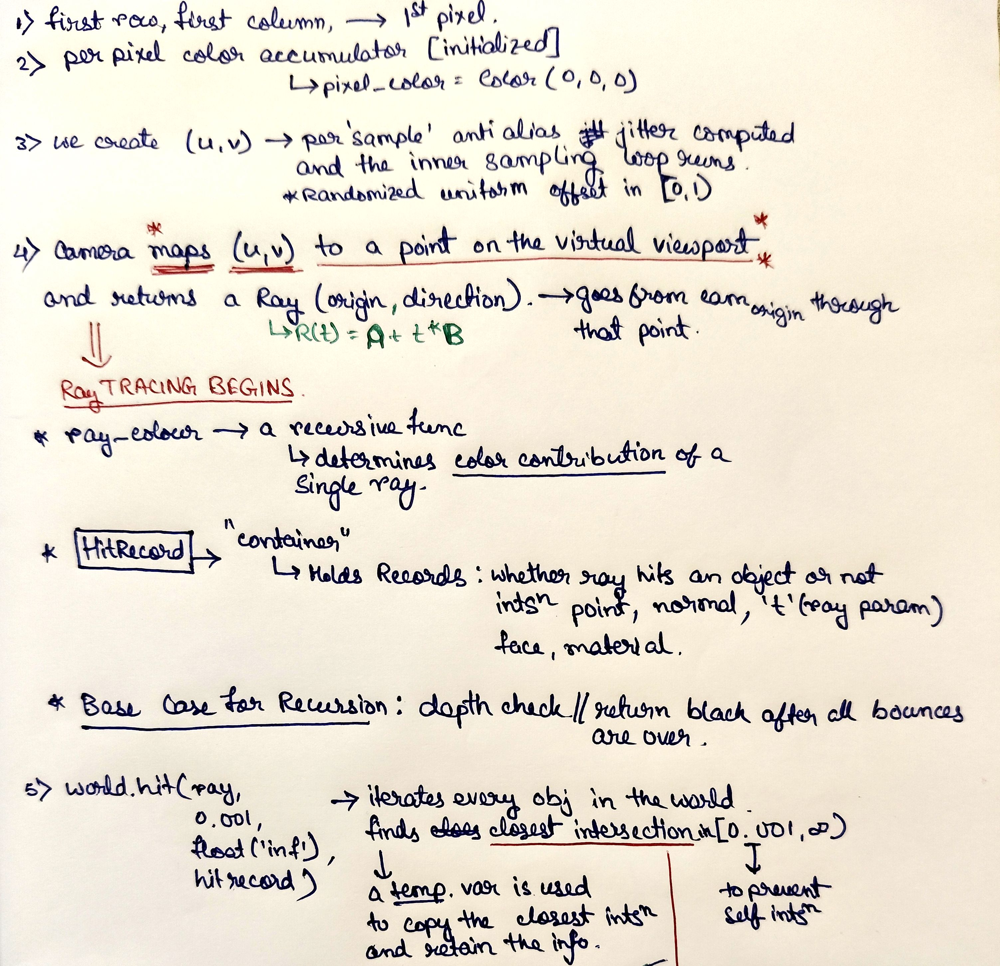
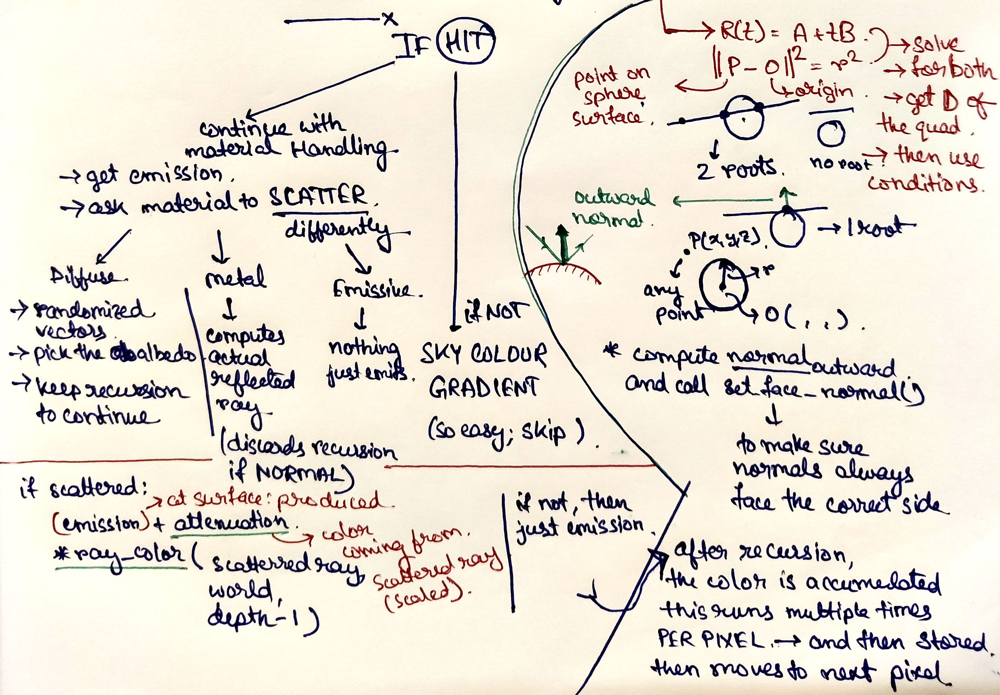
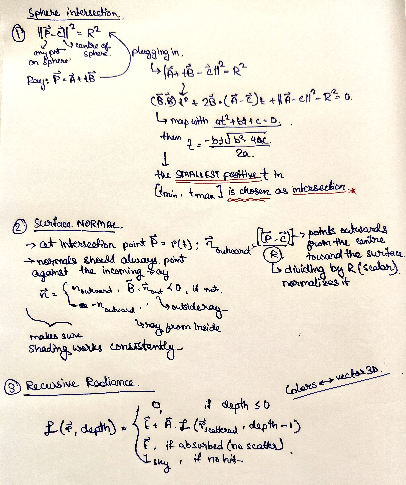

# smol path tracer

Started coding during a boring friday lecture in uni, finally finished on a rainy Saturday

## foreword

**Definition**: *A path tracer is a type of rendering program or algorithm that generates images by simulating the paths of light rays as they bounce around a scene, capturing realistic lighting, shadows, reflections, and refractions.*

**Why in Python**: *I dont know. I wanted to type less words and doze off in between the renders.*  

**Resource**: *[Ray Tracing in One Weekend](https://raytracing.github.io/)* (Part 1 and Part 2)

The heart of the pathtracer is the `ray_color()` function inside `core.utils`.  
I've tried to write extensive comments in various places to explain in short.
I've implemented Sphere and Quadrilaterals till now, and three material types: Lambertian Diffuse, Metal and a
Light Emitting one.

> [!NOTE]
> The first 2 photos are so noisy because I had kept `sampling = 30`, to reduce the rendering time.

Formatted with `black`.

Git clone, and run `main.py`. Tune parameters beforehand. 
The image generated will be of `.ppm` format.

## explanation

> [!NOTE]
> Read [this](https://www.reddit.com/r/GraphicsProgramming/comments/1ej5ffo/raytracing_in_one_weekend_not_understanding_the/) if you are having some trouble with understanding how the `viewport` works.

I don't want to bother myself by typing the same thing again, so just see my scribbles below:

