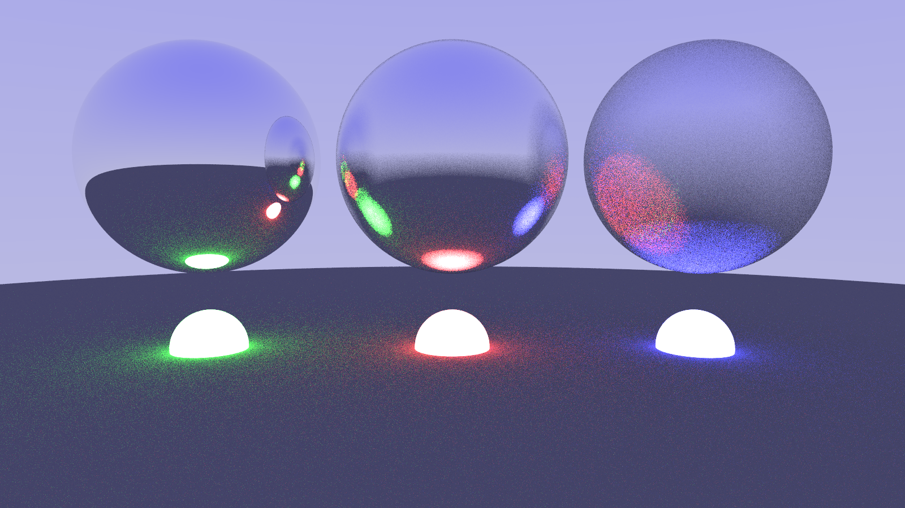
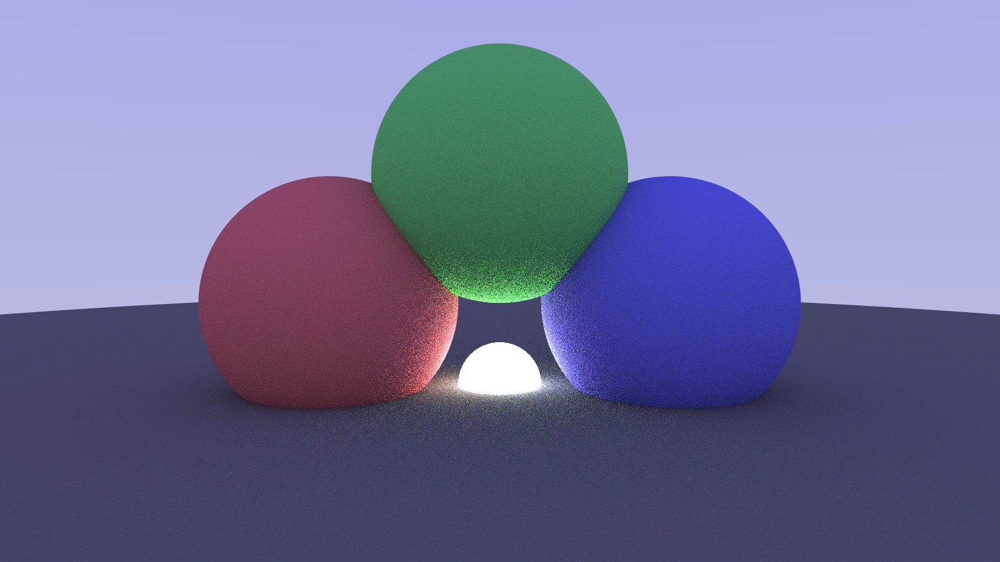

# smol path tracer

**Definition**: *A path tracer is a type of rendering program or algorithm that generates images by simulating the paths of light rays as they bounce around a scene, capturing realistic lighting, shadows, reflections, and refractions.*  
**Why in Python**: *I dont know. I wanted to type less words and doze off in between the renders.*  
**Resource**: *[Ray Tracing in One Weekend](https://raytracing.github.io/)* (Part 1 and Part 2)

I'll write the explanation of how it works (in my own words) later on.

Formatted with `black`.  
The heart of the pathtracer is the `ray_color()` function inside `core.utils`.  
I've tried to write extensive comments in various places to explain in short.

## demos 

I've implemented Sphere and Quadrilaterals till now, and three material types: Lambertian Diffuse, Metal and a 
Light Emitting one.  
the reason they are so noisy is because I had kept `sampling = 30`, to reduce the render time.

